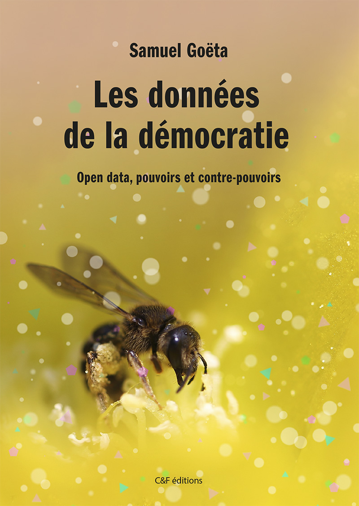
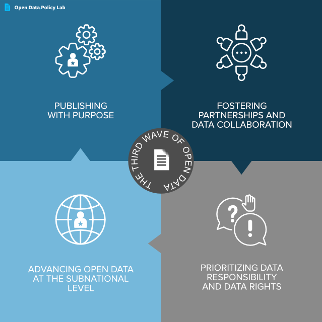

```{r, echo=FALSE}
library(metathis)
meta() %>% 
  meta_description(params$event) %>% 
  meta_name("github-repo" = paste0("datactivist/", params$slug)) %>% 
  meta_viewport() %>% 
  meta_social(
    title = params$title,
    url = paste0("https://datactivist.coop/", params$slug),
    image = params$image,
    image_alt = params$image_alt,
    og_type = "website",
    og_author = "Datactivist",
    og_locale = "fr_FR",
    og_site_name = "Datactivist",
    twitter_card_type = "summary",
    twitter_creator = "@datactivi_st")

```

layout: true

<style>
.remark-slide-number {
  position: inherit;
}

.remark-slide-number .progress-bar-container {
  position: absolute;
  bottom: 0;
  height: 4px;
  display: block;
  left: 0;
  right: 0;
}

.remark-slide-number .progress-bar {
  height: 100%;
  background-color: #e95459;
}

</style>


`r paste0("<div class='my-footer'><span>", params$event, "</span> <center><div class=logo><a href='https://datactivist.coop/'></a></div></center></span></div>")` 


---
class: inverse, center, middle
background-image: url(./img/ademec.png)


## Les données de la démocratie
### Un bilan critique de l'open data

### Samuel Goëta
### Datactivist et Sciences Po Aix

---
class: center, middle

Ces slides en ligne : `r paste0("http://datactivist.coop/", params$slug)`

Sources : `r paste0("https://github.com/datactivist/", params$slug)`


Les productions de Datactivist sont librement réutilisables selon les termes de la licence [Creative Commons 4.0 BY-SA](https://creativecommons.org/licenses/by-sa/4.0/legalcode.fr).

<BR>
<BR>


---
.pull-left[
### Un livre à paraître .red[bientôt]
<br/>
<br/>

<span style="font-size:1.2em">En précommande : https://cfeditions.com/donnees-ouvertes/ </span>
]

.pull-right[


]


---
### Les données ouvertes : une question de .red[démocratie]

.red[Comment faire pour mettre les données ouvertes au service des citoyens  et de la démocratie ? L’open data est-il vraiment un contre-pouvoir ?]

.pull-left[


Open data : accès à la matière première de l’information et du savoir. Refaire les calculs et proposer de nouvelles interprétations.  

—> Un outil de la « contre-démocratie » : enrichit la démocratie, la conforte et fait système avec les institutions démocratiques

—> Un outil d’empowerment et d’émancipation
]

.pull-right.center[


]

---
.red[**Chapitre 1**]

<h3 style="margin-top:0px"> Les racines multiples de l'open data </h3>
Loin d'être un phénomène récent, un héritage historique et conceptuel varié : 

.pull-left[

1. transparence et le droit d’accès à l’information
2. la liberté de l’information et le logiciel libre
3. le partage des données de la recherche
4. la modernisation des administrations
5. les industries de l’information 
6. l’entrainement des modèles d’intelligence artificielle.
]

.pull-right[


]
---
.pull-left[
.red[**Chapitre 2**]

<h3 style="margin-top:0px;margin-bottom:0px"> Vers une .red[troisième vague] de l'open data ? </h3>

.reduite[]
]

--
.pull-right[
.red[**Chapitre 3**]

<h3 style="margin-top:0px;margin-bottom:0px"> L’ancrage .red[instable] de l’ouverture des données dans l’administration </h3>
Des premières initiatives locales à la mise en œuvre de la loi pour une République numérique

.center[]
]
---

.red[**Chapitre 4**]

<h3 style="margin-top:0px;margin-bottom:0px"> La pandémie de Covid-19, un .red[moment charnière] pour l’open data </h3>

.pull-left[
- Des premières ouvertures de données incitées par des initiatives citoyennes

- Des données réutilisées massivement, une relance de la politique d’ouverture des données

- L’émergence des médiateurs

- La pandémie : collaboration ou concurrence entre l’État et la société civile

- L’open data : une arme anti-complotisme ?
]

.pull-right[


.footnote[illustration : hackathon covid ]
]

--- 
.red[**Chapitre 5**]

<h3 style="margin-top:0px;margin-bottom:0px"> Un renouvellement de la transparence .red[en demi-teinte] </h3>


---

# Merci !

Contact : [samuel@datactivist.coop](mailto:samuel@datactivist.coop)


